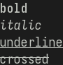

# Format

Format is a modern C formatting library.
It provides features similar to [libfmt](https://fmt.dev) or Python's formatting facility.

This library requires a Gnu99 compiler (gcc or clang). Mind you that the recommended standard version is Gnu23.
If you use this library in a Gnu99 project, you will get warnings when including the `include/format.h` header.
These warnings can be ignored, but you might want so silence them globally.

- [Usage](#usage)
  - [Setup](#setup)
  - [Examples](#examples)
  - [Outputs](#outputs)
- [Grammar](#grammar)
  - [Basis](#basis)
    - [Number](#number)
    - [Size](#size)
    - [Specifier](#specifier)
    - [Alignment](#alignment)
  - [Style & Colors](#style--colors)
  - [Type Formatting](#type-formatting)
    - [String](#string)
    - [Char](#char)
    - [Signed Integers](#signed-integers)
    - [Unsigned Integers](#unsigned-integers)
- [Advanced usage](#advanced-usage)
  - [Collection formatting](#collection-formatting)
  - [Custom Allocators](#custom-allocators)
  - [Experimental APIs](#experimental-apis)
- [Q&A](#qa)
- [Planned Features](#planned-features)
- [License](#license)

# Usage

See [Advanced usage](#advanced-usage) if you want more options.

## Setup

To use `format` as a library to your project, I recommend the following setup:
 * Fetch the library using git; either as a submodule, or via a make/cmake rule
 * Compile the static `libformat.a`: `make -C libs/format`
 * Link your binary with `libformat.a` and add `-I./libs/format/include` to access the library header `format.h`

```
# Add as git submodule, you might want to pin to a release version
git submodule add https://github.com/ef3d0c3e/format libs/format
```
Add this to your Makefile:
```make
# Static libformat.a location
LIBFORMAT_A := ./libs/format/libformat.a
# Add to IFLAGS and LFLAGS
IFLAGS += -I./libs/format/include/
LFLAGS += $(LIBFORMAT_A)

# Rule for building libformat.a
$(LIBFORMAT_A):
    @echo "Building libformat..."
    $(MAKE) -C $(dir $(LIBFORMAT_A))

# Add this all your targets that depend on libformat:
my-target: $(LIBFORMAT_A)
```

The default make target for format builds `libformat.a`, which is what you should be using in your projects.

Example program:
```c
#include <format.h>

int main()
{
    // You can use __attribute__((cleanup(format_output_destroy))) to avoid the call to destroy at the end
    struct format_output out = format_output_file(stdout);

    format(&out, "Hello, {}!\n", "World");

    format_output_destroy(&out); // will flush!
}
```

## Examples

**Strings**
```c
// Quotes:
format(&out, "{:#()}, {:#''}\n", "Hello", "World");
// (Hello), 'World'

// Width, with proper fill characters alignment:
format(&out, "|{:{2}<20}|\n|{:{2}<20}|\n", "Lorem", "amet", ". ");
// |Lorem . . . . . . . |
// |amet. . . . . . . . |

// Unicode support:
format(&out, "{:Ӆ^21}\n", "Hello");
// ӅӅӅӅӅӅӅӅHelloӅӅӅӅӅӅӅӅ

// Non null-terminated strings:
struct {
    char *value;
    size_t len;
} str;
str.value = "This is an example.";
str.len = 7;
format(&out, "{:.{1}}\n", str.value, str.len);
// This is
```

**Integers formatting**
```c
// Hex/Binary:
format(&out, "{0:b} {0:#b} {0:x} {0:#x}\n", 123);
// 1111011 0b1111011 7b 0x7b

// Precision:
format(&out, "{0:.5} {0:05} {1:.5} {1:05}\n", 64, -64);
// 00064 00064 -00064 -0064

// Sign mode:
format(&out, "'{0:+}' '{0:-}' '{0: }' '{1:+}' '{1:-}' '{1: }'\n", 1, -1);
// '+1' '1' ' 1' '-1' '-1' '-1'
```

**Array formatting**
```c
const int arr[] = {2, 3, 5, 7, 11, 13};

// Format individual array elements:
format(&out, "{:[6]:{.4b}}\n", FORMAT_ARRAY(arr));
// {0010, 0011, 0101, 0111, 1011, 1101}

// Custom delimiters:
format(&out, "{:[3]#( ):{}}\n", FORMAT_ARRAY(arr));
// (2 3 5)

// Dynamic array size:
format(&out, "{:[{1}]:{}}\n", FORMAT_ARRAY(arr), sizeof(arr)/sizeof(arr[0]));
// {2, 3, 5, 7, 11, 13}
```

**Style & Colors**
```c
// Colors
format(&out, "{fg#af2f2f bg#4fff4f}Hello{bg#4f4fff}World{/0}\n");
```


```
// Style
format(&out, "{/b}bold{/b}\n{/i}italic{/i}\n{/u}underline{/u}\n{/c}crossed{/0}\n");
```


**User defined types**

You can format user defined types using the following:
```c
// return 0 on success, -1 on errors
int format_my_type(struct format_output* output, /* where to write to */
               const char* fmt_spec, /* format string, right after ':' */
               const struct format_env* env, /* arguments passed to format */
               size_t idx) /* index of the argument to format */
{
    // Your implementation ...
    return 0;
}
```

Then when calling the `format` macro, wrap your value like this: `format(out, "{}", (format_my_type, my_value))`.

`format` exposes common parsers for commonly defined grammar elements: `alignment`, `number`, `size`, `specifier`.
You should be using those to parse your custom format string.

Here's an example custom formatter for a pair with width support:
```c
struct pair { int a; int b; };

int format_pair(struct format_output* output,
               const char* fmt_spec,
               const struct format_env* env,
               size_t idx)
{
    struct format_spec_placeholder fill; // fill character
    char align = '<'; // alignment kind
    size_t width = 0; // field width
    
    size_t i = 0;
    if (fmt_spec[i] != '}')
    {
        format_parse_alignment(fmt_spec, &i, env, &align, &fill, " " /* default: fill using spaces */);
        width = format_parse_size(fmt_spec, &i, env);
    }
    assert(fmt_spec[i] == '}');

    // Get the pair
    const struct pair *pair = (const struct pair*)env->args[idx].data;

    // Compute the width it takes to format the pair
    struct format_output width_output = format_output_none();
    format(&width_output, "({}, {})", pair->a, pair->b);
    const size_t fmt_width = width_output.size;


    // Compute left/right alignment
    size_t left = 0, right = 0;
    switch (align) {
        case '^':
            left = (width > fmt_width ? width - fmt_width : 0);
            right = left / 2;
            left -= right;
            break;
        case '<':
            right = width > fmt_width ? width - fmt_width : 0;
            break;
        case '>':
            left = width > fmt_width ? width - fmt_width : 0;
            break;
    }

    // Write left spacing
    if (format_write_placeholder(output, &fill, left, 0))
        return -1;
    
    // Write pair values
    format(output, "({}, {})", pair->a, pair->b);

    // Write Right spacing
    if (format_write_placeholder(output, &fill, right, 1 /* to print in reverse */))
        return -1;

    return 0;
}
```

You can use the formatter like this:
```c
struct pair p = {6, 7};

format(&out, "{}\n", (format_pair, &p));
// (6, 7)

format(&out, "|{:>10}|\n", (format_pair, &p));
// |    (6, 7)|
format(&out, "|{:-^10}|\n", (format_pair, &p));

format(&out, "|{:-^10}|\n", (format_pair, &p));
// |--(6, 7)--|
```


## Outputs

Format support 4 kinds of outputs, which is where `format` will write its output:
 * `format_output_file(FILE*)` this will output to a stdio `FILE*`, it's useful if you want to use `stdout`/`stderr` and let stdio handle flushing as it already does for `printf`.
 * `format_output_fd(int fd)` this will output to a file descriptor. By default, the output to file descriptor is buffered (1024 bytes).
 * `format_output_buf()` this will output to an internal buffer, that will grow dynamically to hold the formatted strings. You can make multiple calls to `format`, which will grow the buffer to contain the concatenation of all messages.
 * `format_output_none()` this will not output, but keep track of size. This can be used to determine how many bytes it would take to format a given format string with its arguments.

At any given time, if you wish to flush the formatted content, call `format_output_flush(struct format_output*)`:
 * If the outputs is a `FILE*`, this will simply call `fflush()` on the contained `FILE*`.
 * If the output is a file descriptor, this will write the internal buffer.
 * Otherwise, this has no effects

You can also set the flushing strategy for file descriptors. By calling `format_output_set_flush(struct format_output* output, enum format_output_flush_mode mode)`.
Here are the available `format_output_flush_mode`:
 - `kFormatFlushNewline` flush on newlines (similar to stdio's default strategy for `stdout`/`stderr`)
 - `kFormatFlushNone` flush when the internal buffer is full
 - `kFormatFlushAlways` always flush. Use this if you don't want to have a buffer

*Note that this has no effects if you're not using the file descriptor output. If you're using the `FILE*` output mode, you should use stdio's to control how flushing is handled.*

**WARNING:** If you want to set the flushing mode, you must call `format_output_set_flush` BEFORE writing to the output. If you've called `format` on the output, the result is undefined.

# Grammar

## Basis

Below are the basic building blocks of the grammar:

### Number

<p><b>number</b> <b> := </b> <b> integer </b> <em>parse literally from the format string</em> <br>
 &nbsp;&nbsp;&nbsp;&nbsp; &nbsp;&nbsp;&nbsp;&nbsp; <b>| '{' integer '}'</b> <em>parse integer and retrieve the corresponding argument in the argument list</em></p>

**Examples**
 * `format(out, "{:.5}", "Hello, World")`
 * `format(out, "{:15}", "Hello, World")`
 * `format(out, "{:.{1}}", "Hello, World", 4)`
 * `format(out, "{:[{1}]}", FORMAT_ARRAY(array), sizeof(array) / sizeof(array[0]))`

### Size

Size are parsed exactly like <a href="#number">Number</a>, except they are limited to `16384`.
When referring to *width*, they commonly refer to the number of UTF-8 code points, and not the number of bytes.

### Specifier

<p><b>spec</b> <b> := </b> <b> codepoint </b> <em>parse literally from the format string</em> <br>
 &nbsp;&nbsp;&nbsp;&nbsp; &nbsp;&nbsp;&nbsp;&nbsp; <b>| '{' integer '}'</b> <em>parse integer and retrieve the corresponding argument (as a string) in the argument list</em></p>

**Examples**

 * `format(out, "{:#[]}", "Hello") -> "[Hello]"`
 * `format(out, "{:#''}", "Hello") -> "'Hello'"`
 * `format(out, "{:{1}<10}", 15, ". ") -> "15. . . . "`

### Alignment

<p><b>alignment</b> <b> := </b> <a href="#specifier">spec?</a> <em> fill string</em> <b>'&lt;'</b> <em>left-aligned</em> <br>
 &nbsp;&nbsp;&nbsp;&nbsp; &nbsp;&nbsp;&nbsp;&nbsp; <b>|</b> <a href="#specifier">spec?</a> <em> fill string</em> <b>'&gt;'</b> <em>right-aligned</em> <br>
 &nbsp;&nbsp;&nbsp;&nbsp; &nbsp;&nbsp;&nbsp;&nbsp; <b>|</b> <a href="#specifier">spec?</a> <em> fill string</em> <b>'~'</b> <em>center-aligned</em></p>

Define the alignment mode and set the fill string for a formatted value.
When no alignment is specified, the default is to left-align.

Here are the possible alignment:
 * `<` (default) left-align
 * `>` right-align
 * `^` center-align

**Examples**

 * `format(out, "{:>10}", "Hello") -> "     Hello"`
 * `format(out, "{:<10}", "Hello") -> "Hello     "`
 * `format(out, "{:^10}", "Hello") -> "   Hello  "`
 * `format(out, "{:-^10}", "Hello") -> "---Hello--"`
 * `format(out, "{:{1}>10}", "Hello", "-_") -> "-_-_-Hello"`

## Style & Colors

Formatting for style and colors works differently than the rest of the format specifiers.

The syntax goes like this:
<p><b>color</b> := </b> ( <b>'fg'</b> | <b>'bg'</b> ) <b>'#'</b> <br>
 &nbsp;&nbsp;&nbsp;&nbsp; &nbsp;&nbsp;&nbsp;&nbsp; (<br>
 &nbsp;&nbsp;&nbsp;&nbsp; &nbsp;&nbsp;&nbsp;&nbsp; &nbsp;&nbsp;&nbsp;&nbsp; <b>3 or 6 hexadecimal digits</b> <em>parse number from hexadecimal</em> <br>
 &nbsp;&nbsp;&nbsp;&nbsp; &nbsp;&nbsp;&nbsp;&nbsp; &nbsp;&nbsp;&nbsp;&nbsp; | <b>'{'</b> <a href="#number">number</a> <b>'}'</b> <em>color value, between 0 and 0xFFFFFF</em> <br>
 &nbsp;&nbsp;&nbsp;&nbsp; &nbsp;&nbsp;&nbsp;&nbsp; )

<p><b>style</b> := <b>'/'</b> <br>
 &nbsp;&nbsp;&nbsp;&nbsp; &nbsp;&nbsp;&nbsp;&nbsp; (<br>
 &nbsp;&nbsp;&nbsp;&nbsp; &nbsp;&nbsp;&nbsp;&nbsp; &nbsp;&nbsp;&nbsp;&nbsp; <b>'b'</b> <em>toggle bold</em> <br>
 &nbsp;&nbsp;&nbsp;&nbsp; &nbsp;&nbsp;&nbsp;&nbsp; &nbsp;&nbsp;&nbsp;&nbsp; | <b>'i'</b> <em>toggle italic</em> <br>
 &nbsp;&nbsp;&nbsp;&nbsp; &nbsp;&nbsp;&nbsp;&nbsp; &nbsp;&nbsp;&nbsp;&nbsp; | <b>'u'</b> <em>toggle underline</em> <br>
 &nbsp;&nbsp;&nbsp;&nbsp; &nbsp;&nbsp;&nbsp;&nbsp; &nbsp;&nbsp;&nbsp;&nbsp; | <b>'c'</b> <em>toggle crossed</em> <br>
 &nbsp;&nbsp;&nbsp;&nbsp; &nbsp;&nbsp;&nbsp;&nbsp; )+<br>
 &nbsp;&nbsp;&nbsp;&nbsp; &nbsp;&nbsp;&nbsp;&nbsp; | <b>'0'</b> <em>reset style and colors</em> <br>

And the general syntax:
<p><b>style_and_colors</b> := </b> ( <b>color</b> | <b>style</b> )+

When you toggle a style, the other styles aren't impacted.
Similarly, when you set the foreground color, the current background color doesn't change.

## Type Formatting

### String

<p><b>format_string</b> := <a href="#alignment">alignment?</a> <em> alignment</em> <br>
 &nbsp;&nbsp;&nbsp;&nbsp; <a href="#size">size?</a> <em> width of the formatted string</em> <br>
 &nbsp;&nbsp;&nbsp;&nbsp; (<b>'#'</b> <br>
 &nbsp;&nbsp;&nbsp;&nbsp; &nbsp;&nbsp;&nbsp;&nbsp; <a href="#specifier">spec</a> <em> right quote</em> <br>
 &nbsp;&nbsp;&nbsp;&nbsp; &nbsp;&nbsp;&nbsp;&nbsp; <a href="#specifier">spec</a> <em> left quote</em> <br>
 &nbsp;&nbsp;&nbsp;&nbsp; )? <br>
 &nbsp;&nbsp;&nbsp;&nbsp; (<b>'.'</b> <br>
 &nbsp;&nbsp;&nbsp;&nbsp; &nbsp;&nbsp;&nbsp;&nbsp; <a href="#number">number</a> <em> precision, maximum number of BYTES to display</em> <br>
 &nbsp;&nbsp;&nbsp;&nbsp; )? <br>
 &nbsp;&nbsp;&nbsp;&nbsp; ( <b>'s'</b> | <b>'?'</b> | <b>'x'</b> )? <em>display type</em></p>

**Examples**

 * `format(out, "{}", "Hello, World!") -> "Hello, World!"`
 * `format(out, "{:.5}", "Hello, World!") -> "Hello"`
 * `format(out, "{:#''}", "Hello") -> "'Hello'"`
 * `format(out, "{:#[]}", "Hello") -> "[Hello]"`
 * `format(out, "{:5}", "a") -> "a    "`
 * `format(out, "{:->5}", "a") -> "----a"`
 * `format(out, "{:5.2}", "Hello") -> "He   "`
 * `format(out, "{:?}", "\nT\x87") -> "\nT\x87"`
 * `format(out, "{:x}", "\nT\x87") -> "0x0aT0x87"`

### Char

<p><b>format_string</b> := <a href="#alignment">alignment?</a> <em> alignment</em> <br>
 &nbsp;&nbsp;&nbsp;&nbsp; <a href="#size">size?</a> <em> width of the formatted string</em> <br>
 &nbsp;&nbsp;&nbsp;&nbsp; (<b>'#'</b> <br>
 &nbsp;&nbsp;&nbsp;&nbsp; &nbsp;&nbsp;&nbsp;&nbsp; <a href="#specifier">spec</a> <em> right quote</em> <br>
 &nbsp;&nbsp;&nbsp;&nbsp; &nbsp;&nbsp;&nbsp;&nbsp; <a href="#specifier">spec</a> <em> left quote</em> <br>
 &nbsp;&nbsp;&nbsp;&nbsp; )? <br>
 &nbsp;&nbsp;&nbsp;&nbsp; ( <b>'c'</b> | <b>'?'</b> | <b>'x'</b> )? <em>display type</em></p>

### Signed Integers

Most common signed integer types can be formatted: `signed char, short, int, long, long long`

<p><b>format_signed</b> := <a href="#alignment">alignment?</a> <em> alignment</em> <br>
 &nbsp;&nbsp;&nbsp;&nbsp; (<b>'-'</b> | <b>'+'</b> | <b>' '</b>)? <em>sign</em> <br>
 &nbsp;&nbsp;&nbsp;&nbsp; <b>'#'</b>? <em>alternate mode</em> <br>
 &nbsp;&nbsp;&nbsp;&nbsp; <b>'0'</b>? <em>align with <span class="tt">0</span>'s</em> <br>
 &nbsp;&nbsp;&nbsp;&nbsp; <a href="#size">size?</a> <em> width of the formatted number</em> <br>
 &nbsp;&nbsp;&nbsp;&nbsp; (<b>'.'</b> <br>
 &nbsp;&nbsp;&nbsp;&nbsp; &nbsp;&nbsp;&nbsp;&nbsp; <a href="#number">number</a> <em> precision</em> <br>
 &nbsp;&nbsp;&nbsp;&nbsp; )? <br>
 &nbsp;&nbsp;&nbsp;&nbsp; ( <b>'x'</b> | <b>'X'</b> | <b>'b'</b> | <b>'B'</b> )? <em>display type</em></p>

**Sign**

The sign mode operates like printf's:
 * `-` (default) shows the sign for negative numbers only
 * `+` shows the sign for all numbers
 * ` ` shows the sign for negatives numbers, and displays a placeholder white space for other numbers

**Alternate mode**

Alternate mode operates like printf's:
when present, numbers formatted in hexadecimal, or binary will show the `0x`/`0X` or `0b`/`0B` prefix.

**Precision**

Precision operates like printf's, the value corresponds to the minimum width of the number to display. If the number requires less digits than the precision, then it's *prepended* with 0's.

For instance, `format(out, "{:.5}", -1)` will display `-00001`, while `format(out, "{:.5}", 123456)` will display `123456`.

**Display type**

The display type argument defines how the number is formatted:
 * `x`/`X` formats the number as hexadecimal, the uppercase `X` displays the hexadecimal as uppercase and the alternate mode prefix is displayed as `0X`
 * `b`/`B` formats the number as binary, the uppercase `B` displays the alternate mode's `0b` prefix as `0B`

By default, the number is formatted in base 10, like printf's `%d` or `%i`.

**Examples**

 * `format(out, "{}", 123) -> "123"`
 * `format(out, "{:x}", 123) -> "7b"`
 * `format(out, "{:#x}", 123) -> "0x7b"`
 * `format(out, "{:#X}", 123) -> "0x7B"`
 * `format(out, "{:05}", 1) -> "00001"`
 * `format(out, "{:05}", -1) -> "-0001"`
 * `format(out, "{:+}", 1) -> "+1"`
 * `format(out, "{: }", 1) -> " 1"`
 * `format(out, "{:.5}", 1) -> "-00001"`

### Unsigned Integers

Most common unsigned integer types can be formatted: `unsigned char, unsigned short, unsigned int, unsigned long, unsigned long long`

<p><b>format_signed</b> := <a href="#alignment">alignment?</a> <em> alignment</em> <br>
 &nbsp;&nbsp;&nbsp;&nbsp; <b>'#'</b>? <em>alternate mode</em> <br>
 &nbsp;&nbsp;&nbsp;&nbsp; <b>'0'</b>? <em>align with <span class="tt">0</span>'s</em> <br>
 &nbsp;&nbsp;&nbsp;&nbsp; <a href="#size">size?</a> <em> width of the formatted number</em> <br>
 &nbsp;&nbsp;&nbsp;&nbsp; (<b>'.'</b> <br>
 &nbsp;&nbsp;&nbsp;&nbsp; &nbsp;&nbsp;&nbsp;&nbsp; <a href="#number">number</a> <em> precision</em> <br>
 &nbsp;&nbsp;&nbsp;&nbsp; )? <br>
 &nbsp;&nbsp;&nbsp;&nbsp; ( <b>'x'</b> | <b>'X'</b> | <b>'b'</b> | <b>'B'</b> )? <em>display type</em></p>

Unsigned integers are formatted similarly to Signed Integers, except they don't have the *sign* specifier.
See [Signed Integers](#signed_integers) for reference.

# Advanced usage

The library is compiled with `-Wall -Wextra -Wconversion -pedantic -std=gnu23`.
By default it builds using this additional flag: `-ggdb`. This is controlled by `EXTRA_CFLAGS`, which you can set when calling `make -C` from your own Makefile:
```make
$(LIBFORMAT_A):
    @echo "Building libformat..."
    $(MAKE) EXTRA_CFLAGS='-O2' -C $(dir $(LIBFORMAT_A))
```

## Collection formatting

You can format collections with the following code:
```c
format(out, "{:[N]:{x}}", FORMAT_COLLECTION(collection, iterator, formatter))

// Where iterator:
typedef int (*format_collection_iterator)(const struct format_arg_collection* collection,
                                          const void* data, /* formatted collection
                                          size_t n, /* number between `[` and `]` in the format string */
                                          format_collection_callback callback, /* function called on every array elements */
                                          void* cookie /* data to pass to `callback` */);
```
 - `N` is the number of elements to display from the collection, it will be passed to the iterator.
 - `{x}` is the format string for every element inside the collection.
 - `collection` is a pointer to the collection (array, linked list head, tree root, ...).
 - `iterator` is the iterator.
 - `formatter` is the formatter for elements inside the collection.

Here are two example iterators implementation, for arrays and a linked list:
```c
/* Array iterator */
static int
iterator_array(const struct format_arg_collection* collection,
                                  const void* array,
                                  size_t n,
                                  format_collection_callback callback,
                                  void* cookie)
{
    for (size_t i = 0; i < n; ++i) {
        const void* val = (const void*)((const char*)array + i * collection->elem_size);

        int result;
        if (collection->is_pointer) {
            result = callback(collection, (uint64_t)*(uintptr_t*)val, cookie);
        } else {
            uint64_t value = 0;
            memcpy(&value, val, collection->elem_size);
            result = callback(collection, value, cookie);
        }
        if (result == -1)
            return -1;
        if (result == 0)
            break;
    }

    return 0;
}

/* Linked-list */
struct node
{
    int val;
    struct node* next;
};

/* Linked-list iterator */
int
iterator_linked_list(const struct format_arg_collection* collection,
                       const void* head,
                       size_t n,
                       format_collection_callback callback,
                       void* cookie)
{
    struct node* node = (struct node*)head;
    for (size_t i = 0; node && i < n; ++i) {
        int result;
        // No specific logic around collection->elem_size/is_pointer because node just stores `int`
        uint64_t value = node->val;
        result = callback(collection, value, cookie);
        if (result == -1)
            return -1;
        if (result == 0)
            break;
        node = node->next;
    }

    return 0;
}
```

The iterator for arrays is part of format, so you can invoke it like this:
 - `FORMAT_ARRAY(array)` if you want to use the default formatter for elements
 - `FORMAT_ARRAY(array, collection)` if you wish to specify the formatter

**Examples**
```c

// Array
int arr[] = {1, 2, 3, 4, 5, 6};
format(out, "{:[6]:{b}}", FORMAT_ARRAY(arr));

// Linked list
const struct node head = {
    .val = 1,
    .next = &(struct node){
        .val = 2,
        .next = &(struct node){
            .val = 3,
            .next = &(struct node){
                .val = 4,
                .next = &(struct node){
                    .val = 5,
                    .next = &(struct node){
                        .val = 6,
                        .next = NULL,
                    },
                },
            },
        },
    },
};
format(out, "{:[6]:{x}}", FORMAT_COLLECTION(&head, iterator_linked_list, format_fmt_int));
```

## Custom Allocators

You can specify custom allocators that will be used by the library when needed:
 - `void* malloc(size_t size)`: A memory allocator, returns `NULL` on errors
 - `void* free(void *ptr, size_t size)`: A freeing function, `size` is the requested allocation size for `ptr`
 - `void* realloc(void *ptr, size_t old_size, size_t new_size)`: A re-allocator function, `old_size` is the requested allocation size for `ptr`. `new_size` is the requested size.
 When `ptr` is `NULL`, it must behave like `malloc(new_size)`.

Here's an example, `mmap`-based custom allocator:
```c
/* Simple mmap-based allocator */
static void*
mmap_malloc(size_t size)
{
	const size_t page = (size_t)sysconf(_SC_PAGESIZE);
	size_t n = 1;
	while (page * n < size)
		n *= 2;
	void *ptr = mmap(NULL, n * page, PROT_READ | PROT_WRITE, MAP_ANONYMOUS | MAP_PRIVATE, -1, 0);
	if (ptr == MAP_FAILED)
		return NULL;
	return ptr;
}

static void
mmap_free(void *ptr, size_t size)
{
	const size_t page = (size_t)sysconf(_SC_PAGESIZE);
	// size does not need to be aligned to a page boundary
	munmap(ptr, size);
}

static void*
mmap_realloc(void *ptr, size_t old_size, size_t new_size)
{
	if (!ptr)
	{
		return mmap_malloc(new_size);
	}

	const size_t page = (size_t)sysconf(_SC_PAGESIZE);

	// Must align old_size to page boundaries
	{
		size_t n = old_size / page;
		while (n * page < old_size)
			++n;
		old_size = n * page;
	}

	size_t n = 1;
	while (page * n < new_size)
		n *= 2;
	void *new_ptr = mremap(ptr, old_size, n * page, MREMAP_MAYMOVE);
	if (new_ptr == MAP_FAILED)
		return NULL;
	return new_ptr;
}
```

Once you've created a `struct format_output`, you may call `format_output_set_allocator`, for instance like this:
```
format_output_set_allocator(&out, mmap_malloc, mmap_free, mmap_realloc);
```
**NOTE:** It is undefined behavior to change the allocator after you've called `format` or `format_output_write` on the output.

## Experimental APIs

Currently there is 1 experimental APIs: Object formatting.

**Object formatting**

Object formatting is 'functional' as of now, but formatting of sub-objects is still not up to standards. Mainly, it's missing automatic indentation, you have to manually specify the 'depth' of sub-objects such that they appear with the correct number of tabs.
While it's undocumented, you can read [tests/fmt_object.c](tests/fmt_object.c), on how the macro works.

# Q&A

**Q:** Which compilers and C versions are supported?

**A:** Currently, `clang` and `gcc` are supported. You need at least `C99`, but the recommended version is `C23`. `C99` compiles fine, but some features are disabled (mainly better static assertions), and `clang` complains about some features not being standard `C99`, but being supported by `GNUC`.

**Q:** How are errors handled?

**A:**
 1. An error that happens when writing to the underlying output is reported by `format`.
A return value of `0` means success, and `-1` means an error happened.
The library doesn't touch `errno`, so you might want to handle certain errors. Note however that errors can happen AFTER some content was written to the output.
 2. Any error in the format string will result in the program deliberately exiting (via assert). I've tried to make assert messages clear, so they might help you fix your format strings.

**Q:** How is unicode supported?

**A:** Unicode is supported at the code point level, through UTF-8.
Format strings can contain code points without any issue.
However, the library treats one code point as one unit of width, no `wcwidth`.
The reason behind this is that on most modern terminals, `wcwidth` is deprecated because you need to know the font used in order to properly account for width.
For instance `🧑🏽‍🦽` is a single grapheme with 4 code points.
It should display using two cells, but `wcwidth` doesn't support graphemes at all, so it might chose 6 cells instead (man + skin tone + wheelchair).
On top of that, for proper width computation, you need to know the font, because fonts can define custom substitutions.

**Q:** What is the type safety of this library against `printf`?

**A:** This library is *mostly* type safe.
For instance you never specify the type of the arguments in the format string.
Instead, the types information is embedded at compilation, thanks to `typeof` and `GNUC` features such as `__builtin_classify_type` and `__builtin_choose_expr`.
However, some custom features aren't type safe.
For instance collection formatting isn't type safe as of now.
Nevertheless, I have plans on improving this in the future.

**Q:** What allocations does this library make?

**A:** This library never allocates if you're formatting to a `FILE*`, or to a file descriptors in `kFormatFlushAlways` mode.
Otherwise, it will allocate memory in the following scenarios:
 * Formatting to a file descriptor in `kFormatFlushNewline` or `kFormatFlushNone` (1024 bytes).
 * Formatting to an internal buffer, this is the required behavior to emulate `asprintf`.

Note that there are plans to let you specify a custom allocator, there is an untested API to do it right now, but until it's thoroughly tested, you should not use it.

**Q:** Which part of the library is public and which parts are private?

**A:** Due to the heavy use of macros, the public header is littered with internal library code.
In order to separate what's public from private, everything that starts with `format__` or `FORMAT__` is private, the rest is public.

# Planned Features
 - Float formatting
 - Proper object formatting
 - Time formatting
 - Easier API for formatting collections
 - Proper custom allocators support
 - Support for formatting to a user-owned buffer

# License

This project is licensed under the [MIT License](./LICENSE)
